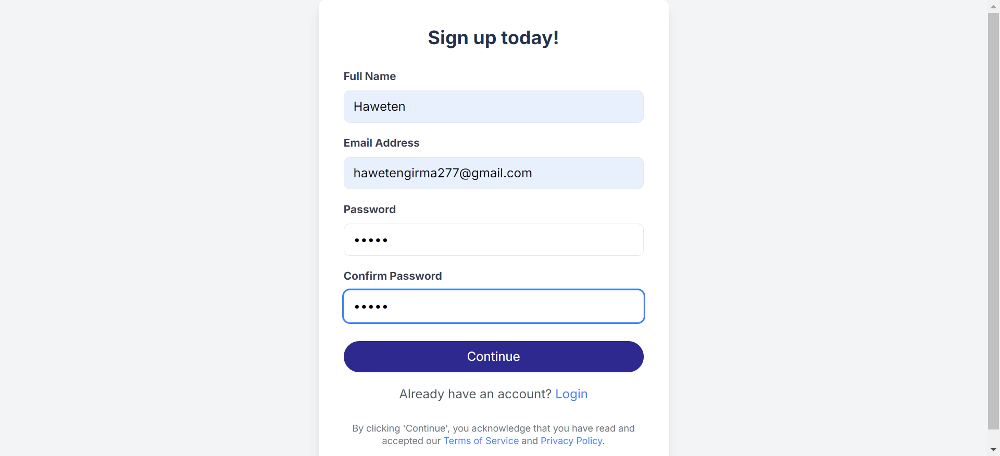

# User Authentication with NextAuth

## Objective

This project implements authentication functionality using NextAuth, including user signup and sign-in pages. It integrates with provided API endpoints for user registration and authentication.

## Features

- **User Signup:** Allows users to create a new account with their email, password, and additional information.
- **User Sign In:** Enables users to log in using their email and password.
- **Email Verification:** Provides functionality to verify the user's email address with a one-time password (OTP).
- **Secure Token Handling:** Stores and manages authentication tokens securely.
- **Client-Side Validation:** Ensures user inputs are validated before submission to improve user experience and reduce unnecessary server requests.
- **Error Handling:** Provides clear feedback for login and signup failures, including handling verification issues.

## Screenshots
### Sign Up


### Sign In


### Verification


### Dashboard


### Details


### Prerequisites

- Node.js
- Next.js
- `next-auth` package

### Installation

1. **Clone the Repository**

   ```bash
   git clone https://github.com/your-username/User-Authentication.git
   cd User-Authentication
